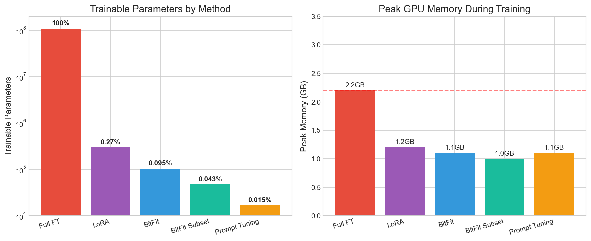
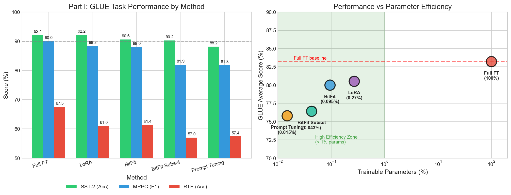
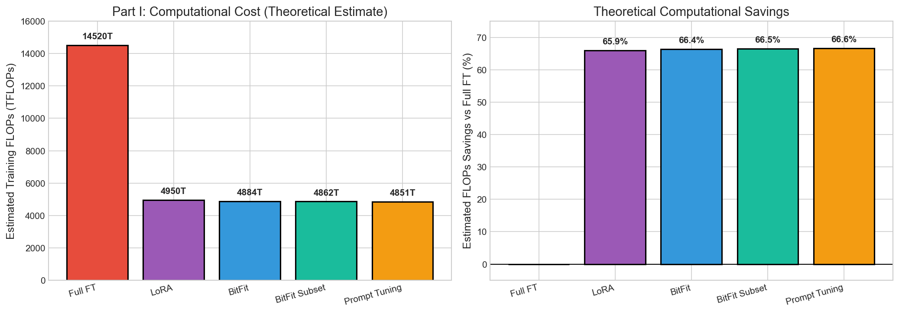
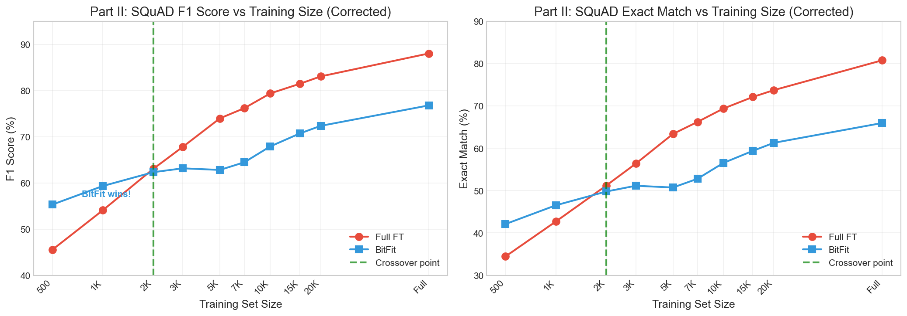

# BitFit & PEFT Experiments on BERT

### Comparing Parameter-Efficient Fine-Tuning Methods vs Full Fine-Tuning

**Datasets:** GLUE (SST-2, MRPC, RTE) + SQuAD v1.1 Low-Data

---

# Motivation: Why PEFT?

## Practical Limitations of Full Fine-Tuning

| Challenge | Full FT Problem | PEFT Solution |
|-----------|-----------------|---------------|
| **Memory** | Store all gradients | ~50% reduction |
| **Storage** | 1 model per task | Shared base + small adapters |
| **Low-data** | Overfitting risk | Built-in regularization |
| **Multi-task** | N × full models | N × tiny deltas |

## Research Question

> How much performance do we lose by training <1% of parameters?

---

# Contributions

## What We Actually Did

1. **Unified codebase** — all PEFT methods in one framework
   - Hydra configs, W&B tracking, reproducible seeds

2. **GLUE benchmark** — 5 methods × 3 tasks
   - Full FT, BitFit, BitFit-subset, LoRA, Prompt Tuning

3. **SQuAD low-data scaling** — hypothesis testing
   - Does BitFit beat Full FT when data is scarce?

4. **Fixed methodology** — step-based training for fair comparison

---

<!-- _class: lead -->
# Part 1: Methods

---

# Methods Overview

| Method | Trainable Params | % of Total | What's Trained |
|--------|------------------|------------|----------------|
| Full FT | 109,483,778 | 100% | Everything |
| BitFit | 104,450 | **0.095%** | All bias terms + classifier |
| BitFit Subset | 47,618 | **0.043%** | Query bias + intermediate bias + clf |
| LoRA (r=8) | 296,450 | **0.27%** | Low-rank adapters on Q,V |
| Prompt Tuning | 16,898 | **0.015%** | 20 virtual tokens + classifier |

**Base:** BERT-base-uncased (109M params)

---

# Implementation: Full Fine-Tuning

## How It Works

All parameters are trainable — standard transfer learning

```python
model = AutoModelForSequenceClassification.from_pretrained(
    "bert-base-uncased", num_labels=num_labels
)
# All 109M parameters get gradients
```

## Our Configuration

| Hyperparameter | Value |
|----------------|-------|
| Learning rate | `2e-5` |
| Weight decay | `0.01` |
| Optimizer | AdamW |
| Scheduler | Linear warmup (10%) |

---

# Implementation: BitFit

## Core Idea

**Only bias terms are trainable** — freeze all weight matrices

For linear: `y = Wx + b` → only `b` gets gradients

```python
def _freeze_except_bias_and_classifier(model):
    for name, param in model.named_parameters():
        if "bias" in name or "classifier" in name:
            param.requires_grad = True
        else:
            param.requires_grad = False
```

## Why It Works

- Biases **shift activations** → change which features fire
- Effectively "selects a subnetwork" inside frozen model
- Pretrained features already capture most of what's needed

---

# Implementation: BitFit Subset

## Even More Aggressive

Only **2 specific biases** per layer + classifier:

```python
def _freeze_except_bitfit_subset_and_classifier(model):
    for param in model.parameters():
        param.requires_grad = False
    
    for name, param in model.named_parameters():
        if "classifier" in name:
            param.requires_grad = True
        elif "attention.self.query.bias" in name:  # attention steering
            param.requires_grad = True
        elif "intermediate.dense.bias" in name:    # FFN activation
            param.requires_grad = True
```

**Rationale:** Query bias affects attention patterns; intermediate bias affects FFN gating

---

# Implementation: LoRA

## Low-Rank Adaptation

Inject trainable rank-`r` matrices alongside frozen weights:

$$W' = W + BA \quad \text{where } B \in \mathbb{R}^{d \times r}, A \in \mathbb{R}^{r \times k}$$

```python
lora_config = LoraConfig(
    r=8,                              # rank
    lora_alpha=16,                    # scaling
    lora_dropout=0.1,
    target_modules=["query", "value"], # where to inject
    bias="none",                       # no bias adaptation
    task_type="SEQ_CLS",
)
model = get_peft_model(base_model, lora_config)
```

**Why Q,V:** Empirically best for BERT; attention is the core mechanism

---

# Implementation: Prompt Tuning

## Learned Soft Prompts

Prepend `k` **learnable embeddings** to input sequence:

```python
class SoftPromptModel(nn.Module):
    def __init__(self, base_model, num_virtual_tokens=20):
        self.soft_prompt = nn.Embedding(num_virtual_tokens, hidden_size)
        nn.init.normal_(self.soft_prompt.weight, std=0.02)
        self._freeze_base_except_classifier()
    
    def forward(self, input_ids, ...):
        input_embeds = self.base_model.bert.embeddings(input_ids)
        prompt_embeds = self.soft_prompt.weight.unsqueeze(0).expand(...)
        combined = torch.cat([prompt_embeds, input_embeds], dim=1)
        # ... rest of forward pass
```

**Injection point:** Embedding layer (before first transformer block)

---

# Methods Summary

| Method | What's Trainable | Where Injected | Params (%) |
|--------|------------------|----------------|------------|
| Full FT | All weights + biases | Everywhere | 100% |
| BitFit | All bias terms | Every layer bias | 0.095% |
| BitFit Subset | Query + Intermediate bias | Attention + FFN | 0.043% |
| LoRA | Low-rank A, B matrices | Q, V projections | 0.27% |
| Prompt Tuning | Virtual token embeddings | Before input | 0.015% |

All PEFT methods also train the **classification head**

---

<!-- _class: lead -->
# Part 2: Experimental Design

---

# Tasks & Datasets

## GLUE Benchmark

| Task | Type | Train Size | Nature |
|------|------|------------|--------|
| **SST-2** | Sentiment | 67K | Simple binary classification |
| **MRPC** | Paraphrase | 3.7K | Medium complexity |
| **RTE** | Entailment | 2.5K | Hard + small dataset |

## SQuAD v1.1

| Task | Type | Train Size | Nature |
|------|------|------------|--------|
| **SQuAD** | QA (extractive) | 88K | Span extraction |

Used for **low-data scaling experiments** (500 → 88K samples)

---

# Metrics

| Task | Primary Metric | Secondary | Note |
|------|----------------|-----------|------|
| SST-2 | Accuracy | — | Binary classification |
| MRPC | F1 Score | Accuracy | Class imbalance |
| RTE | Accuracy | — | Binary entailment |
| SQuAD | Exact Match | F1 Score | Token-level overlap |

**Higher is always better** for all metrics

---

# Training Protocol: GLUE

| Setting | Value | Setting | Value |
|---------|-------|---------|-------|
| Epochs | 3 | Warmup | 10% of steps |
| Batch size | 16 | Precision | FP16 |
| Max seq length | 128 | Seed | 42 |

**Per-method learning rates** (tuned individually):

| Method | LR | Method | LR |
|--------|-----|--------|-----|
| Full FT | `2e-5` | LoRA | `2e-4` |
| BitFit / Subset | `5e-4` | Prompt Tuning | `5e-4` |

No early stopping — fixed 3 epochs for all methods

---

# Training Protocol: SQuAD Scaling

**Challenge:** Dataset size varies 500 → 88K samples

Fixed epochs → small datasets get very few optimization steps

**Solution:** Step-based training with minimum floor

```bash
steps = max(2000, dataset_size / batch_size × 5)
```

| Train Size | Steps | Train Size | Steps |
|------------|-------|------------|-------|
| 500 | 2,000 | 10,000 | 3,125 |
| 1,000 | 2,000 | 20,000 | 6,250 |
| 5,000 | 2,000 | 88,524 | 15,000 |

---

# Methodological Pitfall We Fixed

Initial runs used **fixed epochs** → small datasets got too few steps

| Train Size | Epochs | Steps | Problem |
|------------|--------|-------|---------|
| 1,000 | 2 | 125 | Severe under-training |
| 88,524 | 2 | 11,065 | OK |

**Why it matters:** BitFit needs more iterations (smaller updates per step)

**Impact of fix at 1K samples:**
- Before: BitFit F1 = 14.7%
- After: BitFit F1 = **59.3%** (+44.6%!)

---

<!-- _class: lead -->
# Part 3: GLUE Results

---

# GLUE Results

| Method | SST-2 (Acc) | MRPC (F1) | RTE (Acc) | Avg | Train % |
|--------|-------------|-----------|-----------|-----|---------|
| **Full FT** | <span class="best-overall">92.09%</span> | **90.02%** | **67.51%** | **83.21%** | 100% |
| LoRA | <span class="peft-best"><strong>92.20%</strong></span> | <span class="peft-best">88.32%</span> | 61.01% | <span class="peft-best">80.51%</span> | 0.27% |
| BitFit | 90.60% | 88.01% | <span class="peft-best">61.37%</span> | 79.99% | 0.095% |
| BitFit Subset | 90.25% | 81.94% | 57.04% | 76.41% | 0.043% |
| Prompt Tuning | 88.19% | 81.79% | 57.40% | 75.79% | 0.015% |

---

# Performance vs Parameters



- **LoRA:** Best trade-off — near Full FT with 0.27% params
- **BitFit:** Solid performance with only 0.095% params

---

# GLUE: Per-Task Analysis

## Task Complexity Matters

| Task | Observation |
|------|-------------|
| **SST-2** (easy) | All methods 88-92% — PEFT sufficient |
| **MRPC** (medium) | Gap appears: 90% → 82-88% |
| **RTE** (hard/small) | Biggest gap: 67.5% → 57-61% |

## Key Insight

> Simple tasks: PEFT ≈ Full FT
> Hard tasks: Full FT pulls ahead

RTE is both **hard** (entailment) and **small** (2.5K samples) — double challenge

---

# GLUE Results Visualization



---

# Memory & Compute



**All PEFT methods achieve ~50% peak memory reduction**

---

<!-- _class: lead -->
# Part 4: SQuAD Low-Data Results

---

# SQuAD Scaling: The Hypothesis

> **Does BitFit avoid overparameterization and beat Full FT in low-data regimes?**

## Rationale

| Full FT | BitFit |
|---------|--------|
| 109M trainable params | 104K trainable params |
| High capacity → overfitting risk | Low capacity → implicit regularization |
| Needs more data to generalize | Should generalize better with less data |

**Expected:** BitFit wins with <N samples, Full FT wins with >N samples

---

# SQuAD Results: F1 Score

| Train Size | Full FT | BitFit | Δ F1 | Winner |
|------------|---------|--------|------|--------|
| **500** | 45.5% | 55.3% | **+9.8%** | BitFit ✓ |
| **1,000** | 54.1% | 59.3% | **+5.2%** | BitFit ✓ |
| **2,000** | 63.0% | 62.3% | -0.7% | Tie |
| 3,000 | 67.8% | 63.2% | -4.6% | Full FT |
| 5,000 | 74.0% | 62.8% | -11.2% | Full FT |
| 10,000 | 79.4% | 67.9% | -11.5% | Full FT |
| 88,524 | 88.0% | 76.8% | -11.2% | Full FT |

**Crossover: ~2K samples** — BitFit wins below, Full FT wins above

---

# SQuAD Scaling Curves



---

# Key Finding: BitFit Wins in Extreme Low-Data

| Data Regime | Winner | Gap |
|-------------|--------|-----|
| ≤1K samples | **BitFit** | +5-10% F1 |
| ~2K samples | Tie | ~0% |
| ≥3K samples | **Full FT** | ~11% F1 |

## Why Does This Happen?

1. **Full FT overfits** with 109M params on 500-1K samples
2. **BitFit's constraint** acts as strong regularization
3. At ~2K: Both methods have enough signal
4. Beyond 3K: Full FT's capacity advantage kicks in

---

# Interpretation

## Why BitFit Wins in Low-Data

**Not learning new features — selecting existing ones**

- Pretrained BERT already has rich representations
- Bias shifts **recalibrate** which features activate
- With tiny data: better to reweight than relearn

## Why Full FT Eventually Wins

- More data → less overfitting risk
- Full FT can learn **task-specific features**
- Capacity becomes an advantage, not a liability

---

# Practical Decision Rule

| Data Size | Recommendation |
|-----------|----------------|
| **≤1K** | Use **BitFit** — Full FT will overfit |
| **1K–3K** | Try **BitFit or LoRA** — experiment |
| **≥3K** | Use **Full FT** (or LoRA if constrained) |

| If You Need... | Use |
|----------------|-----|
| Minimal params | Prompt Tuning (0.015%) |
| Best performance | LoRA (0.27%) |
| Simplest code | BitFit (0.095%) |
| Low-data robustness | BitFit |

---

<!-- _class: lead -->
# Part 5: Takeaways

---

# Key Takeaways

1. **PEFT methods work** — achieve 96-98% of Full FT with <1% parameters

2. **LoRA offers best trade-off** — competitive performance at 0.27% params

3. **BitFit shines in low-data** — outperforms Full FT with ≤1K samples

4. **Task complexity matters** — simple tasks benefit most from PEFT

5. **Memory savings are real** — ~50% reduction across all PEFT methods

---

# What We Learned

## About Low-Data Fine-Tuning

> When data is scarce, **parameter constraints = regularization**

The crossover point (~2K samples) is surprisingly early

## What We Recommend

- **Default choice:** LoRA — good balance of performance and efficiency
- **Extreme constraints:** BitFit — simpler, fewer params, low-data advantage
- **Plenty of data:** Full FT still wins

---

# Summary

| Claim | Supported? |
|-------|------------|
| PEFT ≈ Full FT performance | ✓ 96-98% |
| BitFit wins in low-data | ✓ ≤1K samples |
| PEFT saves memory | ✓ ~50% reduction |
| Task complexity matters | ✓ RTE vs SST-2 |

**Reproducibility:** Hydra configs, W&B tracking, fixed seed, single GPU (FP16)

---

<!-- _class: lead -->
# Thank You

### Questions?
